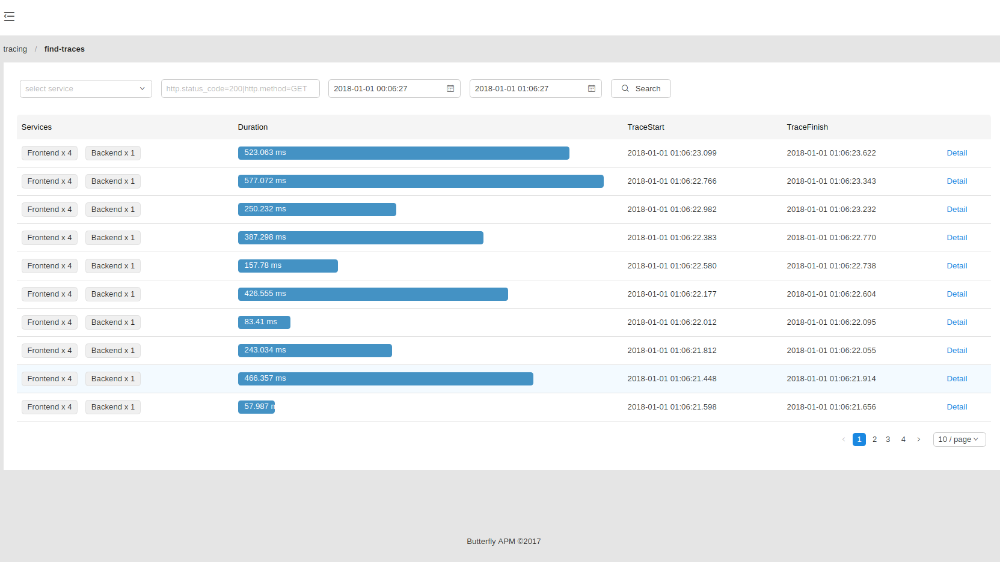
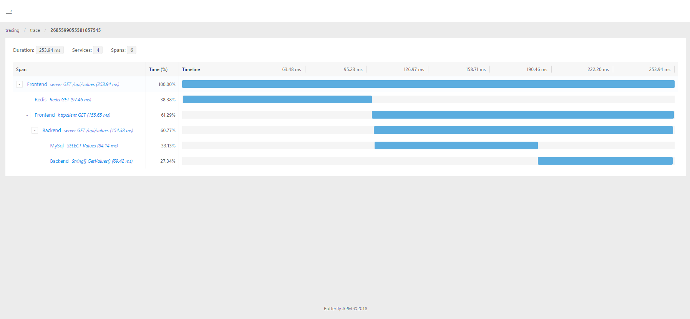
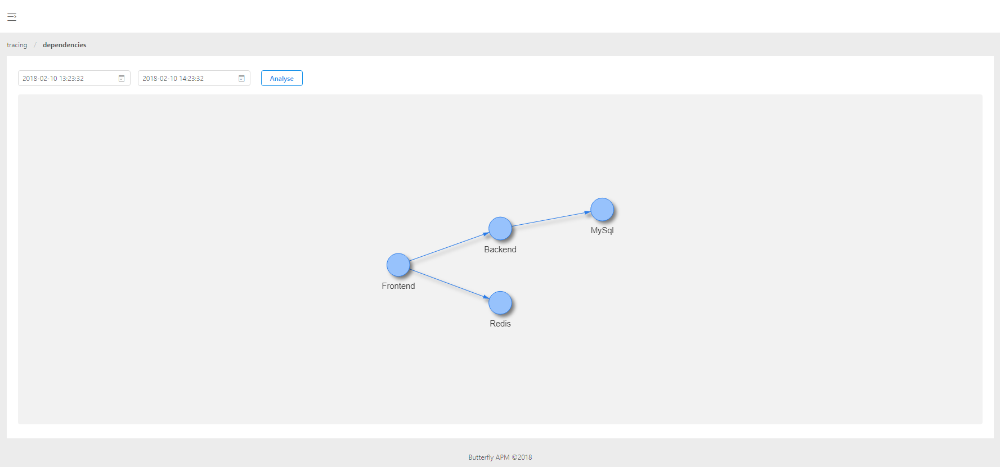

# Butterfly
A distributed tracing system and application performance management.

# Design
Butterfly¡¯s design is based on the [Google Dapper](https://research.google.com/pubs/pub36356.html) paper and [OpenTracing](http://opentracing.io/).
# Quickstart
* download [latest release](https://github.com/ButterflyAPM/butterfly/releases)
* extract `butterfly-server-[latest version]`
* `cd butterfly-server-[latest version]`
* `dotnet butterfly.server.dll`
* browse to [http://localhost:9618](http://localhost:9618) to find traces
### Elasticsearch Storage
Elasticsearch storage supports versions 5.x and applies when `Storage` is set to `elasticsearch`.  
The following apply when `Storage` is set to `elasticsearch`:
```
 `ElasticSearchHosts`: A comma separated list of elasticsearch base urls to connect to ex. http://your_es_host:9200.
              Defaults to "http://localhost:9200".

```
Example usage:
```
dotnet butterfly.server.dll --StorageType=elasticsearch --ElasticSearchHosts=http://localhost:9200
```

# Screenshots
### Find-traces View

### Trace Detail View

### Service dependencies View

